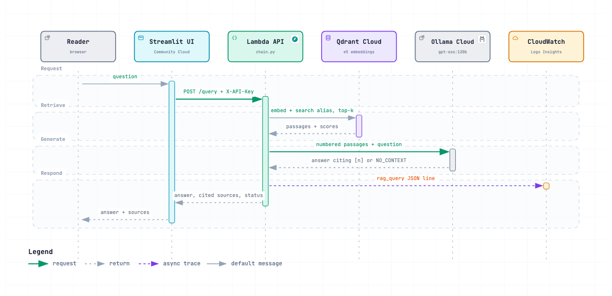

# Document RAG Assistant

Answers business questions over a document corpus, citing the passages each
answer comes from, and says so when the documents do not cover a question.

[](https://github.com/juandsep/document-rag-assistant/actions/workflows/ci.yml)
[](https://github.com/juandsep/document-rag-assistant/actions/workflows/deploy.yml)


**[Try the live demo →](https://document-rag-assistant-portfolio.streamlit.app/)**
Ask about the policies, catalog and services of Norte Retail, a fictional
store (14 documents: text, Markdown, a Word catalog and PDFs), in Spanish or
English. The first question
after a quiet spell waits a few seconds while the API wakes up.

## Why retrieval

A language model answering alone knows nothing about one company's policies,
so it either refuses or guesses, and a guess reads exactly like a fact. This
service retrieves the relevant passages first, lets the model answer only from
them and returns them as sources, so every claim can be checked. On the
labelled question set, the same model, graded by an independent judge
(DeepSeek) ([details](docs/architecture.md#rag-against-the-model-alone)):

| `gpt-oss:120b`, 56 questions, independent judge | With retrieval | Alone |
|---|---|---|
| Correct answers | **100%** | 17% |
| Hallucinated answers | **0%** | 11% |
| Refused although answerable | **0%** | 70% |
| Latency p50 | 1.35 s | 1.00 s |

## How it works


Only the API runs in AWS: one Lambda function serving FastAPI through a
Function URL, with no load balancer or VPC, so nothing is billed while idle
(about $0.05/month). Everything else lives on free tiers outside AWS: Qdrant
Cloud stores the vectors and computes the embeddings, Ollama Cloud generates,
Streamlit Community Cloud hosts the UI, a shared MLflow keeps the
evaluation runs and DeepSeek grades them as an independent judge. Keys sit in an SSM SecureString; every push to `dev` ships a
new image through GitHub Actions and OIDC, with no stored AWS keys.
[Interactive version](https://htmlpreview.github.io/?https://github.com/juandsep/document-rag-assistant/blob/main/docs/diagrams/architecture.html) (pan, zoom, trace a path; source in `docs/diagrams/`).

### One question, end to end



1. **Retrieve.** Qdrant embeds the question with `multilingual-e5-small`, the
   same model that embedded the documents, and returns the top-k passages from
   the collection the `document-rag` alias serves.
2. **Generate.** The model receives only those passages, numbered `[1]..[k]`,
   with rules: cite every claim, answer in the question's language, deduce
   what the passages imply, and reply `NO_CONTEXT` when they do not cover it.
3. **Answer.** The API returns the answer, the passages it cited (document,
   page, score) and a status: `ok`, `insufficient_context` or
   `llm_unavailable`. A Qdrant outage is a `503`: answering without retrieval
   would produce uncited claims.
4. **Measure.** One JSON line per query (latency by stage, top score, tokens)
   feeds the Grafana dashboard through CloudWatch Logs Insights, and readers
   rate each answer 👍/👎 (`POST /feedback`), logged against the same
   `query_id`.

Warm, a question takes about 0.6 s inside the Lambda, almost all of it
generation; a cold start adds 1.3–1.7 s.
[Interactive version](https://htmlpreview.github.io/?https://github.com/juandsep/document-rag-assistant/blob/main/docs/diagrams/query.html).

### Indexing and evaluation

`scripts/index_docs.py` loads `.txt`, `.md`, digital `.pdf` (page by page; scanned
pages are reported, not read) and `.docx`,
cleans and chunks them, drops duplicates, embeds each chunk in Spanish and
English (so a question in either language finds it) and writes a **new**
collection;
nothing overwrites the version that is serving. `scripts/evaluate.py` scores a
candidate (recall@k, MRR, answer decisions, latency), logs the run to MLflow
and moves the alias only when recall@k passes. `scripts/compare.py` measures
the RAG against the model alone. On 56 questions over 14 documents: recall@3
0.97, MRR 0.87, 55/56 right decisions.

## Documentation

| Document | What it covers |
|---|---|
| [docs/architecture.md](docs/architecture.md) | Request path, indexing, evaluation and the RAG comparison, failure behaviour, deployment |
| [PLAN.md](PLAN.md) | Phases, decisions, what the first deploy took |
| [infra/README.md](infra/README.md) | Terraform, costs, first apply, configuration |
| [monitoring/README.md](monitoring/README.md) | CloudWatch alarms and the Grafana dashboard |
| [CONTRIBUTING.md](CONTRIBUTING.md) | Branch flow, commits, local checks |

## Run locally

Requires [uv](https://docs.astral.sh/uv/), Python 3.11, and a `.env` with
`VECTOR_BACKEND=qdrant`, `QDRANT_URL`, `QDRANT_API_KEY`,
`OLLAMA_BASE_URL=https://ollama.com` and `OLLAMA_API_KEY`; `DEEPSEEK_API_KEY` only
for the comparison's judge (all variables:
[infra/README.md](infra/README.md#configuration)).

```bash
uv sync
uv run pytest -q
uv run ruff check . && uv run ruff format --check .

uv run --env-file .env python scripts/index_docs.py eval/corpus   # prints the version
uv run --env-file .env python scripts/evaluate.py --chain         # scores what is serving
uv run --env-file .env python scripts/compare.py                  # RAG vs model alone, DeepSeek judge
uv run --env-file .env rag                                        # API on http://localhost:8000
uv run --env-file .env streamlit run src/rag/ui.py                # UI against RAG_API_URL
```

**Stack:** FastAPI, Qdrant Cloud, Ollama Cloud (`gpt-oss:120b`), MLflow,
Streamlit, AWS Lambda + Function URL, ECR, SSM, CloudWatch + Grafana, uv +
ruff + pytest, Terraform, GitHub Actions (OIDC).

## Contributing

Changes go on a `feat/`, `fix/`, `chore/` or `docs/` branch cut from `dev` and
merge into `dev` through a pull request, which deploys; merging `dev` into
`main` releases. See [CONTRIBUTING.md](CONTRIBUTING.md).
